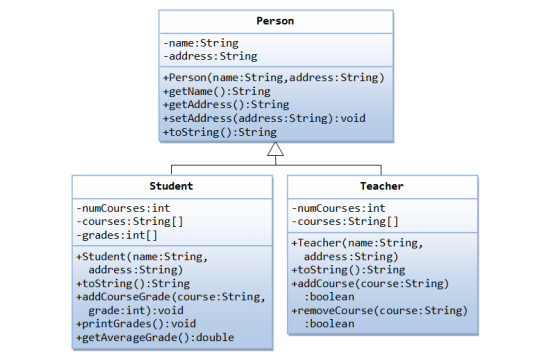

## Exam

#### Create your project correctly. Create classlib Infrastructure and MainApp, then create solution and add them to solution. Each class should have namespace and their members {methods, property, field...} should have correct name.

#### Создайте свой проект правильно. Создайте classlib Infrastructure и MainApp, затем создайте решение и добавьте их в решение. Каждый класс должен иметь пространство имен, а их члены {методы, свойство, поле ...} должны иметь правильное имя.

#### Лоиҳаи худро дуруст эҷод кунед. Infrastructure ва MainApp classlib-ро эҷод кунед, сипас ҳалли худро эҷод кунед ва онҳоро ба ҳалли он илова кунед. Ҳар як синф бояд фазои ном дошта бошад ва аъзоёни онҳо {methods, property, field...} бояд номи дуруст дошта бошанд.

**Question 1:**

- What is the purpose of namespaces in C#? How do they help in organizing code?
- Какова цель пространств имен в C#? Как они помогают в организации кода?
- Ҳадафи фазои номҳо дар C# чист? Чӣ тавр онҳо дар ташкили код кӯмак мекунанд?

---

**Question 2:**

- What is the using directive in C#? How does it help in writing cleaner code?
- Что такое директива using в C#? Как она помогает писать более чистый код?
- Дастури истифода дар C# чист? Чӣ тавр он дар навиштани рамзи тозатар кӯмак мекунад?

---

**Question 3:**

- What are generic and non-generic collections in C#?
- Что такое универсальные и неуниверсальные коллекции в C#?
- Generic ва non-generic collections дар C# кадомҳоянд?

---

**Question 4:**

- Explain the difference between an Array and a List in C#. When would you prefer to use a List over an Array?
- Объясните разницу между массивом и списком в C#. Когда вы бы предпочли использовать список вместо массива?
- Фарқи байни массив ва рӯйхатро дар C# фаҳмонед. Кай шумо бартарӣ медиҳед, ки Рӯйхатро бар массив истифода баред?

---

**Question 5:**

- What is a Dictionary in C#? How does it differ from a List?
- Что такое словарь в C#? Чем он отличается от списка?
- Dictionary дар C# чист? Он аз List чӣ фарқ дорад?

---

**Question 6:**

- What is method Overriding in C#?
- Что такое переопределение методов в C#?
- Усули Overriding дар C# чист?

---

**Question 7:**

- What are the collection types in C#? Write about two of them (not List and Dictionary)
- Какие типы коллекций есть в C#? Напишите о двух из них (не List и Dictionary)
- Намудҳои коллексияҳо дар C# кадомҳоянд? Дар бораи дутои онҳо нависед (на List ва Dictionary)

---

**Question 8:**

- What is the foreach statement and why does it only return values ​​from collections?
- Что такое оператор foreach и почему он возвращает только значения из коллекций?
- Изҳороти foreach чист ва чаро он танҳо арзишҳоро аз коллексияҳо бармегардонад?

---

**Question 9:**

- What is Inheritance? Can I Inherit from Multiple Classes in C#?
- Что такое наследование? Могу ли я наследовать от нескольких классов в C#?
- Мерос чист? Оё ман метавонам аз синфҳои сершумор дар C# мерос гирам?

---

**Question 10:**

- How do different access modifiers (public, protected, private, internal) affect inheritance in C#?
- Как различные модификаторы доступа (public, protected, private, internal) влияют на наследование в C#?
- Чӣ гуна тағирдиҳандаҳои дастрасии гуногун (оммавӣ, муҳофизатшуда, хусусӣ, дохилӣ) ба мерос дар C# таъсир мерасонанд?

---

**Task 1:**

                    Device
          +-------------------------+
          | - brand: String         |
          | - model: String         |
          +-------------------------+
          | + Device(brand: String, |  \
          |          model: String) |   \
          | + getBrand(): String    |    \
          | + getModel(): String    |     \
          +-------------------------+      \
                     /                      \
                    /                        \
                Computer                      Phone
      +-------------------------+|   +----------------------------+
      | - ram: int               |   | - screenSize: double       |
      +---------------------+----|   +----------------------------+
      | + Computer(brand: String,|   | + Phone(brand: String,     |
      |       model: String,     |   |        model: String,      |
      |       ram: int)          |   |        screenSize: double) |
      | + getRam(): int          |   | + getScreenSize(): double  |
      +--------------------------+   +----------------------------+

---

**Task 2:**



---

**Task 3:**

```csharp
List<string> list = new List<string>() {"apple", "banana", "apple", "cherry", "date", "banana", "fig", "grape", "date", "kiwi"};
```

1. 📝 Count the number of unique elements in a list.

2. 🔄 Replace all elements that contain the letter 'a' with the string "fruit".

3. ✂️ Remove all elements that contain the letters 'o' and 'e'.

4. 🔢 Sort the list by string length in ascending order

##

```csharp
List<string> list = new List<string>() {"apple", "banana", "apple", "cherry", "date", "banana", "fig", "grape", "date", "kiwi"};
```

1. 📝 Подсчитайте количество уникальных элементов в списке.

2. 🔄 Замените все элементы, которые содержат букву 'a', на строку "fruit".

3. ✂️ Удалите все элементы, которые содержат буквы 'o' и 'e'.

4. 🔢 Отсортируйте список по длине строк в порядке возрастания

##

```csharp
List<string> list = new List<string>() {"apple", "banana", "apple", "cherry", "date", "banana", "fig", "grape", "date", "kiwi"};
```

1. 📝 Шумораи унсурҳои беназири рӯйхатро ҳисоб кунед.

2. 🔄 Ҳама унсурҳоеро, ки ҳарфи 'a' доранд, бо сатри "мева" иваз кунед.

3. ✂️ Ҳама унсурҳоеро, ки ҳарфҳои 'o' ва 'e' доранд, хориҷ кунед.

4. 🔢 Рӯйхатро аз рӯи дарозии сатр бо тартиби афзоиш мураттаб кунед
